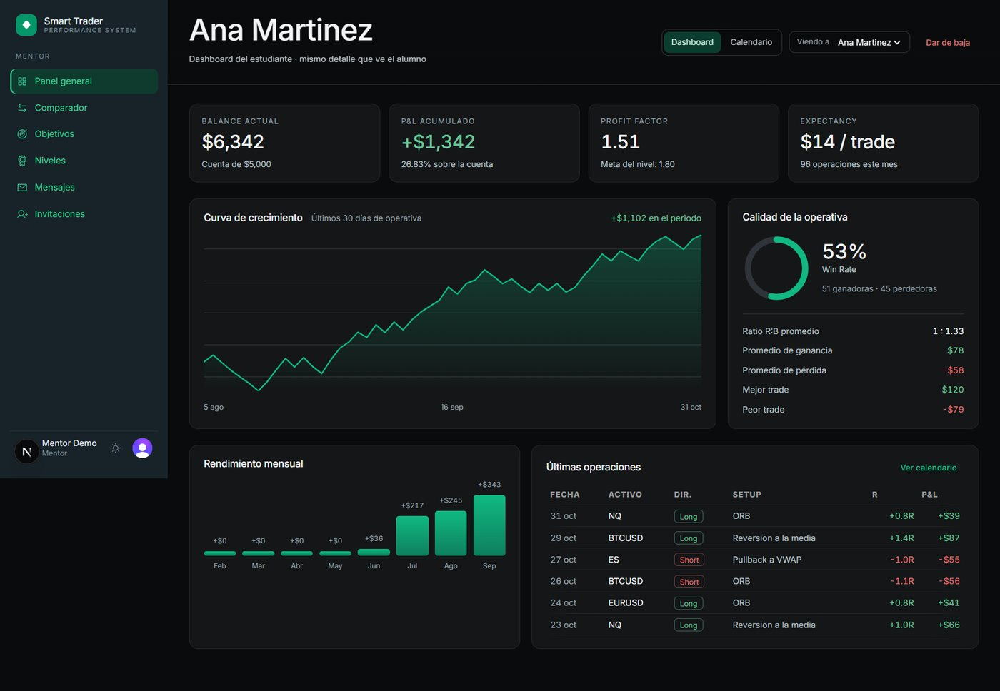
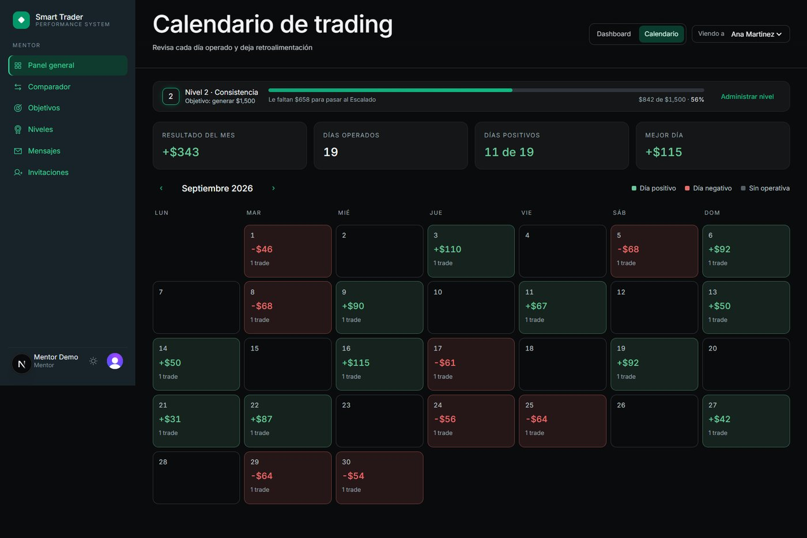
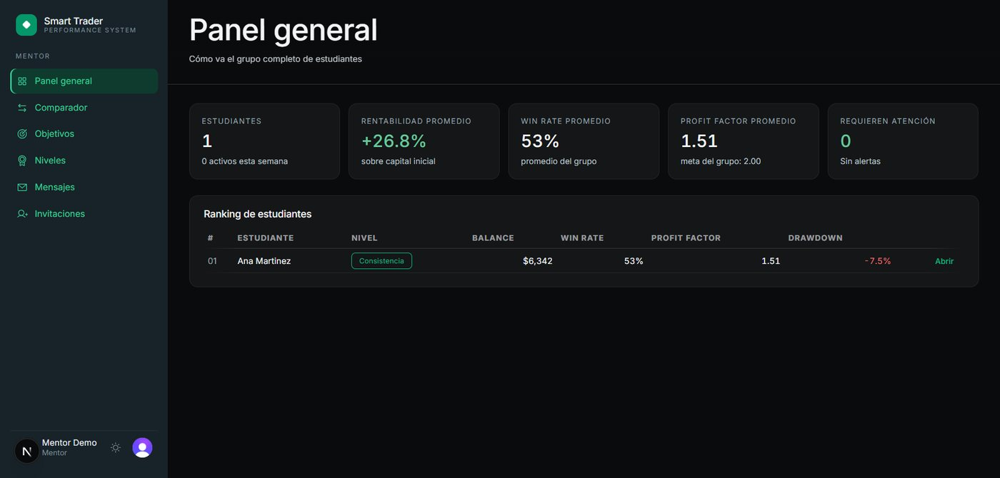
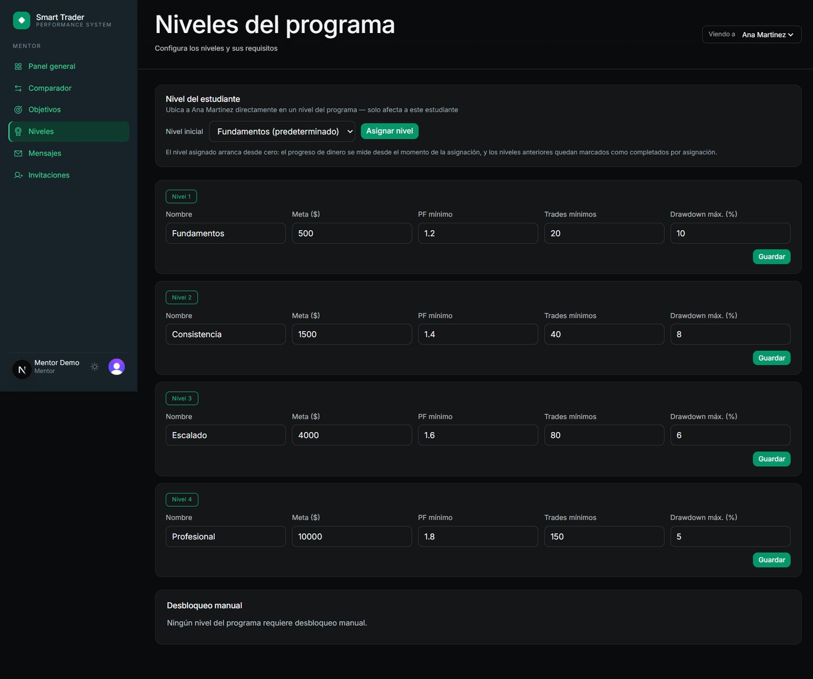
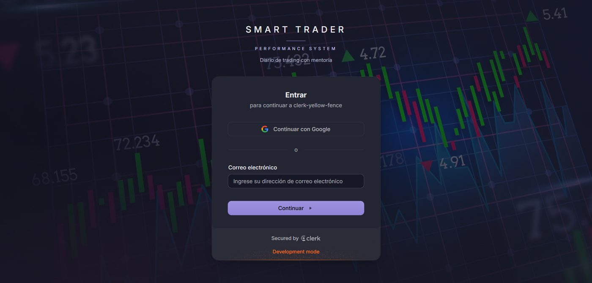

# Smart Trader Performance System

**A trading journal with a mentor on the other side of it.**

A mentor invites students by email, reviews their trades and written journals, leaves feedback, assigns objectives, and moves them through a level system as their performance improves. Students log trades with chart screenshots, track their own equity curve and drawdown, and see exactly what they need to reach the next level.

```
Next.js 16 · React 19 · TypeScript · Drizzle ORM · Neon Postgres · Clerk · Vercel Blob · Tailwind v4 · Vitest + PGlite
```

> **302 tests**, including a full authorization matrix executed against an embedded Postgres instance.

### ▶️ [See it running](https://smart-money-app-two.vercel.app)

[](https://smart-money-app-two.vercel.app)

Registration is **invitation-only by design**: the mentor sends invitations from the `invitaciones` screen, and `/sign-up` returns "acceso restringido" to anyone without one. That is the product working as intended, so the screenshots below come from a local instance with seeded data instead of an open demo account.



**The student dashboard.** Balance, cumulative P&L, profit factor and expectancy, a growth curve with its real drawdowns, win rate with the average win and loss behind it, monthly performance, and the latest trades with their R multiple. Every one of those numbers is computed from the trades on read, never stored.

<table>
<tr>
<td width="50%"></td>
<td width="50%"></td>
</tr>
<tr>
<td><b>Trading calendar.</b> Every day coloured by result, with the level progress bar on top: "$658 to go before Escalado".</td>
<td><b>Mentor panel.</b> The whole cohort at a glance: average return, win rate, profit factor, and who needs attention.</td>
</tr>
<tr>
<td width="50%"></td>
<td width="50%"></td>
</tr>
<tr>
<td><b>Level design.</b> Each level sets a profit goal, a minimum profit factor, a minimum number of trades and a maximum drawdown. Promotion is earned against all four.</td>
<td><b>Sign in.</b> Clerk with email or Google, invitation-only.</td>
</tr>
</table>

> Screenshots are from a local instance seeded with 96 synthetic trades (53% win rate, 1.51 profit factor). No real student data is shown.

---

## The engineering decisions worth reading

### 📊 Metrics are always derived, never stored

Summary statistics, the equity curve, drawdown, level status and goal progress are computed from the trades on every read (`lib/metrics/`). Nothing is denormalized into a totals column.

Storing aggregates would mean every edited, deleted or back-dated trade has to correctly update a cached number somewhere, and the first time that fails, a student's reported performance silently diverges from their actual performance. Deriving costs a little compute and makes an entire class of bug impossible.

### 🔐 Authorization is enforced twice, on purpose

```
Server Action  →  requireUser() / requireMentor()      ← layer 1: is this caller allowed in?
Query layer    →  role + ownership re-checked in SQL   ← layer 2: is this row theirs?
```

The action layer answers *"can you call this?"*; the query layer independently answers *"is this row yours?"* (`lib/db/queries/`). A mentor may read a specific student's trades; a student may never read another student's. Because the second check lives inside the query rather than above it, a new call site cannot accidentally bypass it.

This is the part most worth testing, so it is tested exhaustively:

```bash
npm test    # 302 tests: pure metric functions + the authorization matrix on PGlite
```

**PGlite** runs a real Postgres in-process, so the authorization tests execute genuine SQL against a genuine schema instead of a mocked ORM. A mock would happily confirm behaviour the real database does not have.

### 🕓 Program time is anchored to UTC-6, never to process time

```ts
// lib/app-time.ts: every server-side calendar computation goes through here
```

Trading days, streaks and calendar views belong to the program's timezone, not to whatever region a serverless function happens to boot in. Anchoring explicitly means a deploy to a different region can't shift which day a trade lands on.

### 🖼️ Chart screenshots are private by default

Uploads go to **Vercel Blob** with private access and are served through an authorized route handler (`app/api/captures/[id]/route.ts`) rather than a public URL. A student's screenshots carry their account details and P&L, so a guessable public link would leak them.

---

## Feature map

**Student**

| Route | What it does |
|---|---|
| `dashboard` | Summary metrics, equity curve, drawdown |
| `calendario` | Trading calendar by day |
| `mi-nivel` | Current level, requirements, progress to the next one |
| `objetivos` | Objectives assigned by the mentor |
| `notificaciones` | Feedback and level-change alerts |

**Mentor**

| Route | What it does |
|---|---|
| `panel` | Overview of every student |
| `estudiantes/[id]` | Drill into one student's dashboard and calendar |
| `comparador` | Side-by-side student comparison |
| `objetivos-estudiantes` | Assign and track objectives |
| `niveles` | Define levels and grant them manually |
| `invitaciones` | Invite-only onboarding |
| `mensajes` | Feedback thread |

---

## Data model

`users` · `trades` · `trade_journals` · `trade_captures` · `levels` · `manual_level_grants` · `goals` · `notifications`

Schema and versioned migrations live in `lib/db/schema.ts` and `drizzle/`, managed with Drizzle Kit.

---

## Design system

**Nocturne** is a first-party token set in `styles/nocturne.css` (emerald light/dark themes), not a UI kit dropped in. It deliberately avoids `@layer`; the reasoning is documented at the top of the file.

---

## Running it locally

**Requirements:** Node.js 20+, a Neon (or any Postgres) database, a Clerk application

```bash
git clone https://github.com/raulben6/smart-money-app.git
cd smart-money-app
npm install

cp .env.example .env.local   # fill in the values below
npm run db:migrate           # apply Drizzle migrations
npm run dev                  # http://localhost:3000

npm test                     # 302 tests (serial, PGlite)
```

| Variable | Purpose |
|---|---|
| `DATABASE_URL` | Neon / PostgreSQL connection string |
| `CLERK_SECRET_KEY`, `NEXT_PUBLIC_CLERK_PUBLISHABLE_KEY` | Authentication |
| `BLOB_READ_WRITE_TOKEN` | Vercel Blob, chart captures |
| `MENTOR_EMAIL` | The account bootstrapped with the mentor role |
| `APP_URL` | Absolute base URL used in invitation emails |

Registration is **invite-only**: the mentor sends invitations from `invitaciones`, and Clerk handles email + password or Google sign-in from there.

---

## Workflow

A branch per change → push → automatic Vercel **Preview Deployment** with its own URL → merge to `main` → production deploy. The `fase-1` and `fase-2` tags mark delivered milestones.

---

## License

[MIT](LICENSE) © Raúl Antonio Benítez Vásquez
